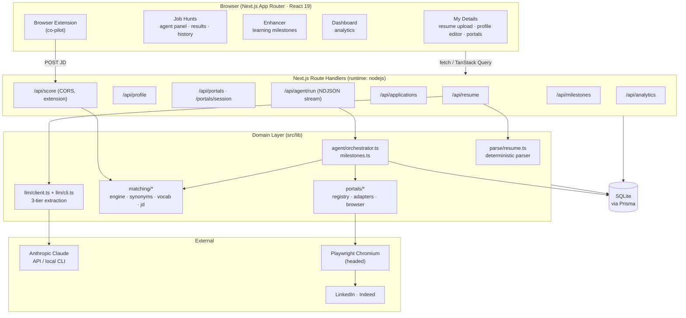
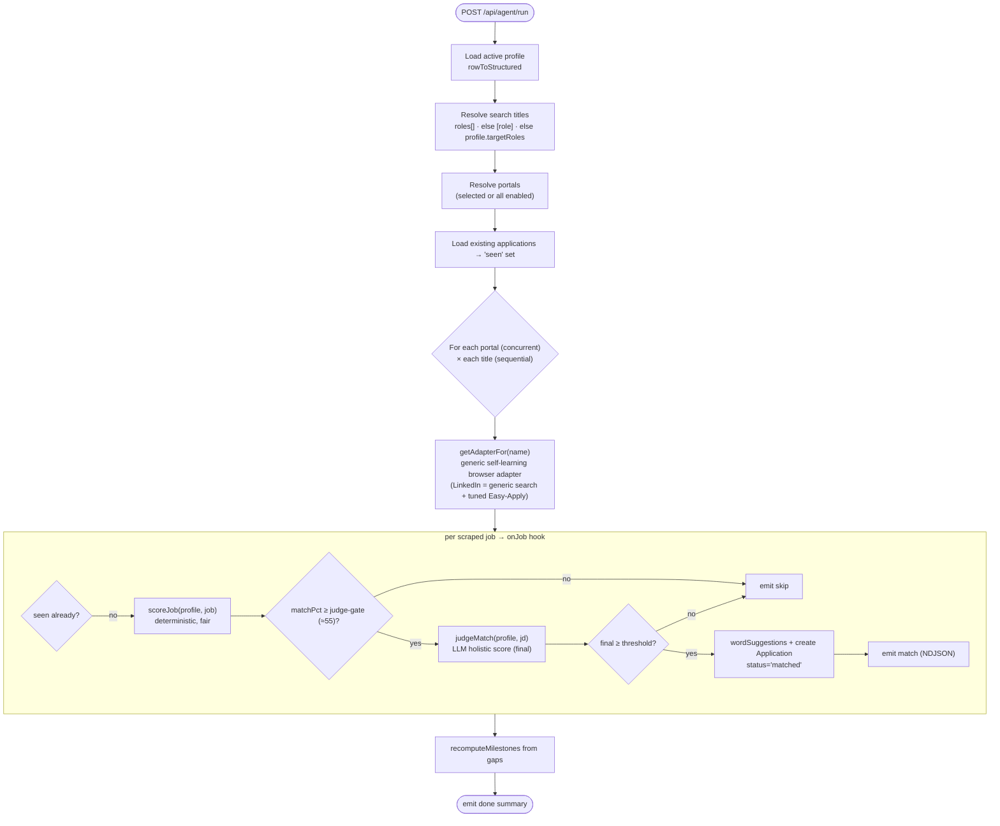
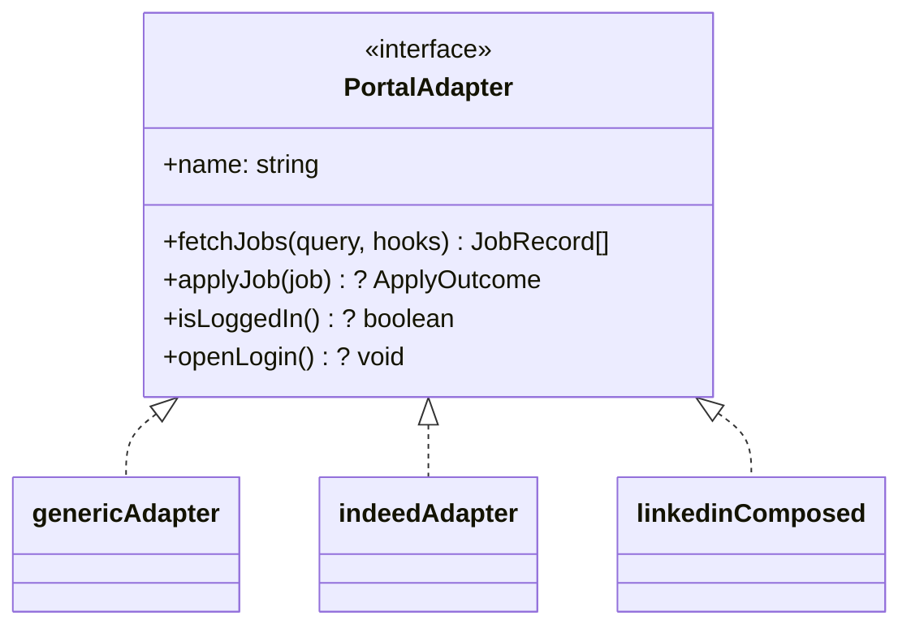
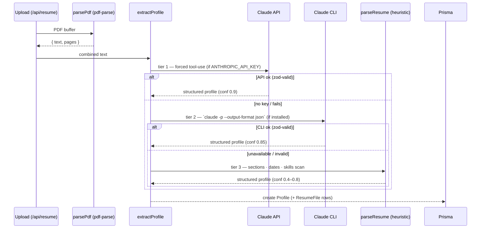
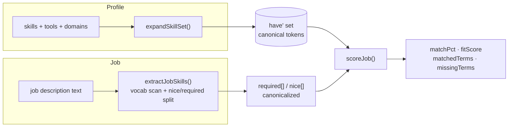
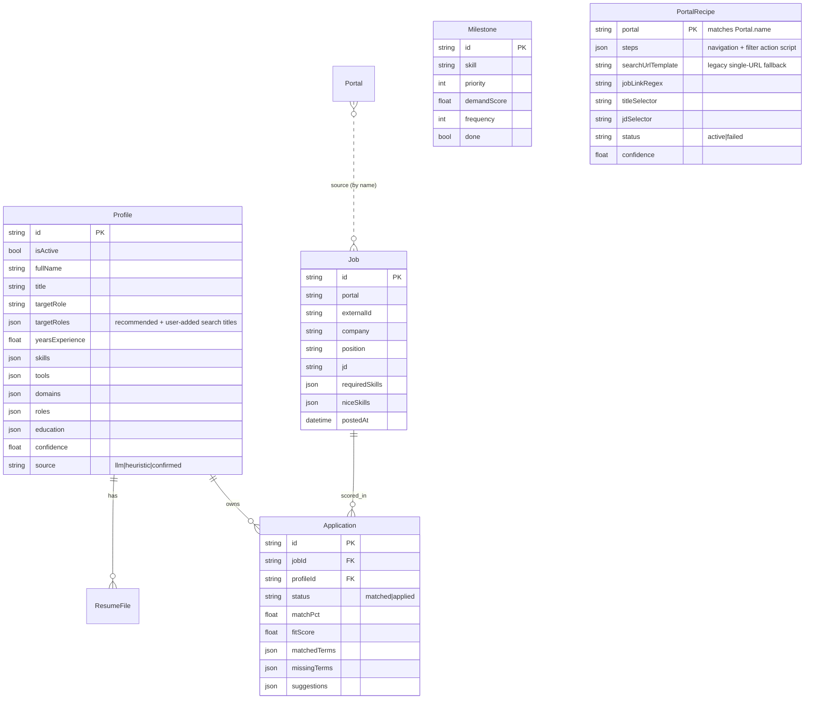

# Job Apply Scout — Technical Architecture

Engineering reference for the codebase: system layout, the agentic loop, data model, key pipelines, and a module-by-module map. For setup and usage see [README.md](./README.md).

---

## 1. System Architecture



**Layering rule:** route handlers are thin (validate with Zod → call a `src/lib` function → return JSON). All domain logic lives in `src/lib`. The LLM never produces scores or job data — it only *reads* the resume; everything scored is deterministic and DB-backed.

---

## 2. Agentic Architecture

The agent runs in **SHORTLIST mode** — it discovers, reads, and scores jobs, then saves matches. It never submits applications.



The deterministic `scoreJob` is a cheap, fair **pre-filter**; jobs that clear the gate get a precise **LLM judge** read (catches hard blockers — citizenship/clearance, far-short years, missing required certs — and credits transferable skills), and the judge's score is the one compared to the user's threshold. The `seen` set dedupes a job surfaced by more than one title.

### Event stream (NDJSON)

`/api/agent/run` returns a streamed `ReadableStream` of newline-delimited JSON so the UI shows live progress instead of waiting for a single response:

```
{"type":"status","message":"Scanning Indeed…"}
{"type":"match","match":{ company, position, matchPct, url, postedAt }}
{"type":"skip","position":"…","matchPct":47}
{"type":"done","summary":{ evaluated, matched, skipped, topMatches, errors }}
```

`AgentEvent` union: `status | match | skip | done | error`. The client reader splits on `\n` and dispatches each event.

### Portal adapter contract



- **Every portal runs in a real browser.** `getAdapterFor` returns the **generic self-learning adapter** for any portal; Indeed keeps a tuned scraper; LinkedIn is *composed* — generic intelligent search + the tuned Easy-Apply/login. There is no mock source.
- Adapters share **one** persistent Chromium context but each portal gets its **own tab** via `browser.getPage(name)` (env `PORTAL_PROFILE_DIR` overrides the profile dir for testing) — so concurrent scans don't abort each other's navigations.
- **Self-learning recipes** (`learn.ts` → `recipe.ts`/`steps.ts`, stored in `PortalRecipe`): the first run on an unknown portal opens the live site and asks the LLM for a replayable **step script** (`goto`/`fill`/`click`/`select`/`press`/`waitFor`) that navigates from the landing page to the *filtered* job feed — mapping the search intent (role→keyword box, remote→workplace filter, recency→date-posted filter) onto the site's real fields. The script is validated end-to-end (real job links + a readable JD via `looksLikeJob`) before it's saved, then replayed deterministically (no LLM) on later runs; a stale recipe self-heals (re-learn once). A login/marketing gate is detected (`pageLooksLikeGate`) and surfaced as "sign in, then retry."
- `fetchJobs` persists each job to the `Job` table (real FK target) and streams it through `hooks.onJob`.

---

## 3. Resume Extraction (3-tier, best-first)



Every tier returns the same `ExtractedProfile` shape (Zod-validated). The deterministic parser (`parse/resume.ts`) segments the doc into sections (summary / experience / skills / education / certifications), parses date ranges into roles with bullets, and scans for vocab skills both in the skills section and inside experience text.

---

## 4. Matching Pipeline (deterministic & explainable)



Key ideas:
- **`expandSkillSet`** (`matching/synonyms.ts`) makes comparison English-aware: each free-text resume skill is aliased *and* scanned for any known vocab term it contains as a whole word — so `"REST APIs"` covers `REST`, `"Node.js development"` covers `Node.js`. Multi-word terms match before single-word fragments; word boundaries prevent false hits (`Java` ≠ `JavaScript`).
- **`scoreJob`** (`matching/engine.ts`) is deterministic and tuned to be *fair* (it's a pre-filter, not the final word):
  - **Required-led, nice as a bonus.** `skillScore = max(reqCov·0.9 + niceCov·0.1, overallCov·0.9)`. Meeting all required skills alone is ~0.9; nice-to-haves lift toward 1.0 but never *penalize* (the old `reqCov·0.8 + niceCov·0.2` capped a perfect required match at 80%). The `overallCov` term cushions required/nice **mis-classification** (the heading split is heuristic).
  - **Years are soft here.** `effectiveFit = 0.6 + 0.4·experienceFit` — a years shortfall tempers but never *zeros* a strong skill match; hard minimum-years blockers are enforced precisely by the judge.
  - A JD with zero recognized skills still scores 0 (no false 100% for non-tech posts).
- **`judgeMatch`** (`matching/llm-judge.ts`) is the precise scorer: it reads the whole JD + profile and returns a calibrated `matchPct` + blockers. Only a *hard* disqualifier caps it ≤30 (citizenship/clearance, a missing mandatory cert/degree, or a years bar the candidate is **>2 years / <60%** short of); a 1–2 year stretch is scored on skills, and transferable skills are credited. In the agent it runs on jobs that pass the deterministic gate; in `/api/score` it's the primary scorer with the deterministic engine as the offline fallback.
- The **same** engine + judge power the agent and the extension co-pilot (`/api/score`), so scores are consistent everywhere. Because matching is profile-based, adding more search **titles** only widens which jobs are fetched — it can't inflate a score.

---

## 5. Data Model



- Only one `Profile` is `isActive`; uploading a resume deactivates the rest. `targetRoles` is seeded with `recommendRoles()` on upload and edited by the user (the agent searches each).
- `PortalRecipe` (one per portal name) is the **learned, replayable** scrape recipe — its `steps` script reaches the filtered feed without an LLM on replay; `status='failed'` triggers a re-learn.
- The `Job` table is the agent's **search universe** — kept across `db:reset`. Clearing history deletes `Application` rows only.
- `Milestone` rows are **derived** from aggregated `Application.missingTerms` and rebuilt after each run (`recomputeMilestones`), preserving done-state by skill.

---

## 6. Codebase Map

```
src/
├─ app/
│  ├─ page.tsx · details/ · history/ · enhancer/   # pages (dashboard, profile, job hunts, milestones)
│  └─ api/
│     ├─ resume/         POST upload+parse (seeds targetRoles), GET active profile+files
│     ├─ profile/        GET ai-availability/status, PATCH user corrections
│     │  └─ roles/        GET recommended titles + selected, POST save chosen titles
│     ├─ portals/        CRUD portals; [id]; session/ (GET status, POST openLogin)
│     ├─ agent/run/      POST → NDJSON stream of the agent loop
│     ├─ applications/   GET (filter/search), DELETE (clear history)
│     ├─ score/          POST JD → match (CORS; browser extension co-pilot)
│     ├─ milestones/     GET list, [id] PATCH done
│     └─ analytics/      GET dashboard stats
├─ lib/
│  ├─ db.ts               Prisma client singleton
│  ├─ pdf.ts              parsePdf (pdf-parse)
│  ├─ parse/resume.ts     deterministic, section-aware resume parser
│  ├─ llm/
│  │  ├─ client.ts        extractProfile (3-tier) · wordSuggestions · aiExtractionAvailable
│  │  └─ cli.ts           local `claude` CLI bridge (detect + extract)
│  ├─ schemas/profile.ts  Zod: ExtractedProfile / role / education
│  ├─ matching/
│  │  ├─ engine.ts        scoreJob — deterministic, fair match/fit (pre-filter)
│  │  ├─ llm-judge.ts     judgeMatch — calibrated LLM scorer + hard blockers
│  │  ├─ synonyms.ts      canonical aliases + expandSkillSet (English-aware)
│  │  ├─ vocab.ts         curated skill vocabulary + demand weights
│  │  └─ jd.ts            extractJobSkills from a JD (required vs nice)
│  ├─ portals/
│  │  ├─ adapter.ts       PortalAdapter interface · JobRecord/ApplyOutcome types
│  │  ├─ generic.ts       self-learning browser adapter (any portal)
│  │  ├─ learn.ts         LLM recipe learner (feed-route + filters, validated)
│  │  ├─ recipe.ts        Step types · substitute · draft validation (pure)
│  │  ├─ steps.ts         deterministic step replayer (no LLM)
│  │  ├─ recipe-store.ts  load/save/markFailed PortalRecipe
│  │  ├─ scrape.ts        harvestJobLinks · scrapeDetail · looksLikeJob · pageLooksLikeGate
│  │  ├─ registry.ts      getAdapterFor (generic; LinkedIn composed; Indeed tuned)
│  │  ├─ browser.ts       shared Playwright context · getPage(tab) · PORTAL_PROFILE_DIR
│  │  ├─ linkedin.ts      tuned Easy-Apply/login (search now via generic)
│  │  ├─ indeed.ts        tuned Indeed scraper (Cloudflare-aware)
│  │  └─ bootstrap.ts     ensureDefaultPortals (idempotent)
│  ├─ agent/
│  │  ├─ orchestrator.ts  runAgent loop (multi-title · judge gate) · resolveSince
│  │  └─ milestones.ts    recomputeMilestones · applyMilestoneToProfile
│  ├─ profile.ts          getActiveProfile · rowToStructured
│  ├─ profile-eval.ts     recommendRoles (ranked titles) · evaluateTargetRole
│  ├─ strength.ts · analytics.ts · types.ts · utils.ts · api.ts
│  └─ store/ui.ts         Zustand UI state
├─ components/            details/ · history/ · dashboard/ · layout/ · ui/
└─ prisma/schema.prisma   Profile · ResumeFile · Job · Application · Portal · PortalRecipe · Milestone
```

### Module responsibilities (quick reference)

| Module | Responsibility |
|--------|----------------|
| `agent/orchestrator.ts` | The loop: load profile → resolve titles + portals → scan each title concurrently → score → judge → save matches → stream events → rebuild milestones. |
| `portals/registry.ts` | Route each portal to its adapter: generic self-learning by default, LinkedIn composed (generic search + tuned apply), Indeed tuned. |
| `portals/learn.ts` + `steps.ts` | Learn a portal's feed-route + filter step script once (LLM, validated), then replay it deterministically. |
| `portals/browser.ts` | One persistent headed Chromium; `getPage(name)` gives each portal an isolated tab. |
| `matching/engine.ts` + `llm-judge.ts` | Deterministic fair pre-filter + calibrated LLM judge — the only places match numbers are produced. |
| `profile-eval.ts` | `recommendRoles` ranks suitable titles from the profile (tech-stack signal + seniority). |
| `matching/synonyms.ts` | Canonicalization + `expandSkillSet` (resume English → vocab tokens). |
| `llm/client.ts` | Tiered resume extraction; LLM strictly reads, never scores. |
| `agent/milestones.ts` | Turn aggregated gaps into prioritized, demand-weighted learning milestones. |

---

## 7. Design Principles

1. **Provable, then judged.** A deterministic set-math score is the fair, repeatable pre-filter; an LLM judge adds calibrated nuance (blockers, transferable skills). The LLM never invents the *skill facts* — those come from the vocab/profile.
2. **Always functional.** No API key, no CLI, no problem — the deterministic parser scores resumes and matches, and learned recipes replay without an LLM. The judge/learner degrade to the deterministic path when no LLM is available.
3. **Thin routes, fat lib.** Route handlers validate and delegate; logic and tests live in `src/lib`.
4. **Local-first & private.** Resume, jobs, and history are local SQLite. Browser sessions persist in a gitignored profile; nothing leaves the machine except optional resume text to the Claude API.
5. **Shortlist, not autopilot.** The agent surfaces and explains; the human decides and applies.
