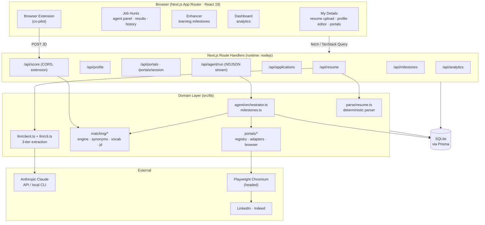
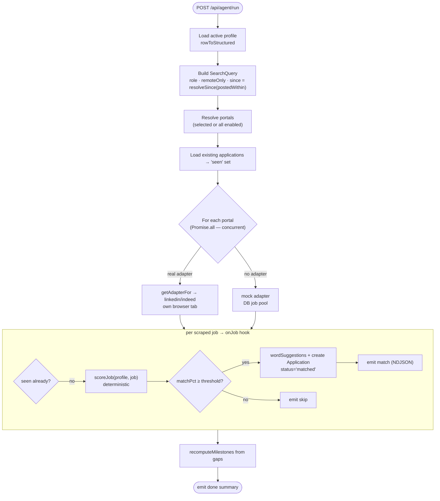
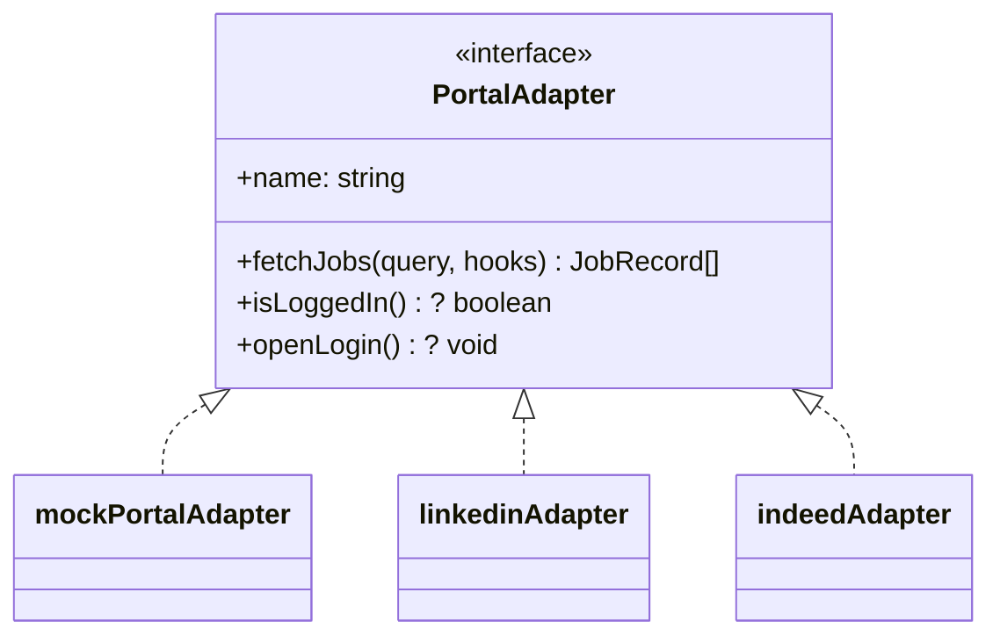
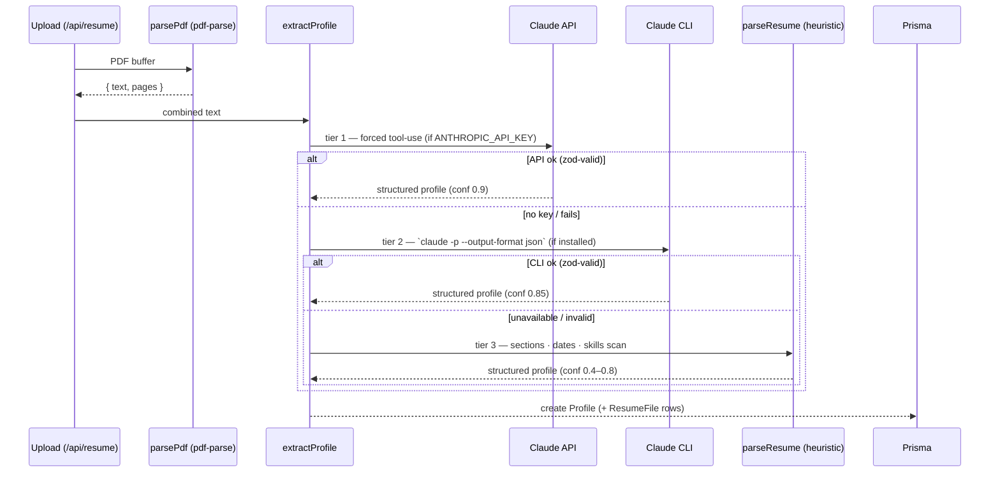
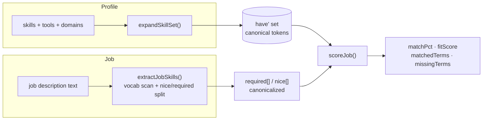
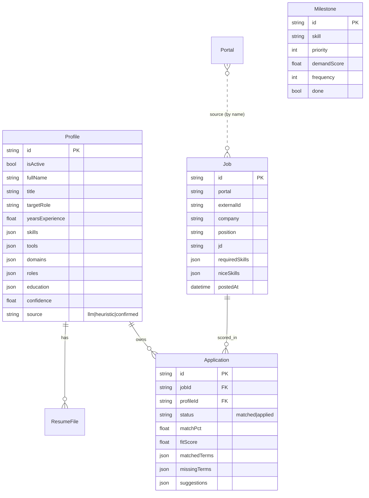

# Job Apply Scout — Technical Architecture

Engineering reference for the codebase: system layout, the agentic loop, data model, key pipelines, and a module-by-module map. For setup and usage see [README.md](./README.md).

---

## 1. System Architecture



**Layering rule:** route handlers are thin (validate with Zod → call a `src/lib` function → return JSON). All domain logic lives in `src/lib`. The LLM never produces scores or job data — it only *reads* the resume; everything scored is deterministic and DB-backed.

---

## 2. Agentic Architecture

The agent runs in **SHORTLIST mode** — it discovers, reads, and scores jobs, then saves matches. It never submits applications.



### Event stream (NDJSON)

`/api/agent/run` returns a streamed `ReadableStream` of newline-delimited JSON so the UI shows live progress instead of waiting for a single response:

```
{"type":"status","message":"Scanning Indeed…"}
{"type":"match","match":{ company, position, matchPct, url, postedAt }}
{"type":"skip","position":"…","matchPct":47}
{"type":"done","summary":{ evaluated, matched, skipped, topMatches, errors }}
```

`AgentEvent` union: `status | match | skip | done | error`. The client reader splits on `\n` and dispatches each event.

### Portal adapter contract



- `registry.isReal(name)` → true iff a real adapter is registered (no env needed). `getAdapterFor` returns the real adapter or the mock.
- Real adapters share **one** persistent Chromium context but each portal gets its **own tab** via `browser.getPage(name)` — so concurrent scans don't abort each other's navigations.
- `fetchJobs` persists each job to the `Job` table (real FK target) and streams it through `hooks.onJob`.

---

## 3. Resume Extraction (3-tier, best-first)



Every tier returns the same `ExtractedProfile` shape (Zod-validated). The deterministic parser (`parse/resume.ts`) segments the doc into sections (summary / experience / skills / education / certifications), parses date ranges into roles with bullets, and scans for vocab skills both in the skills section and inside experience text.

---

## 4. Matching Pipeline (deterministic & explainable)



Key ideas:
- **`expandSkillSet`** (`matching/synonyms.ts`) makes comparison English-aware: each free-text resume skill is aliased *and* scanned for any known vocab term it contains as a whole word — so `"REST APIs"` covers `REST`, `"Node.js development"` covers `Node.js`. Multi-word terms match before single-word fragments; word boundaries prevent false hits (`Java` ≠ `JavaScript`).
- **`scoreJob`** (`matching/engine.ts`): `matchPct` = required coverage (×0.8) + nice coverage (×0.2). `fitScore` blends skill score (dominant) with years-closeness and an applicant-pool factor. A JD with zero recognized skills scores 0 (no false 100% for non-tech posts).
- The **same** engine powers the agent and the extension co-pilot (`/api/score`), so scores are consistent everywhere.

---

## 5. Data Model



- Only one `Profile` is `isActive`; uploading a resume deactivates the rest.
- The `Job` table is the agent's **search universe** — kept across `db:reset`. Clearing history deletes `Application` rows only.
- `Milestone` rows are **derived** from aggregated `Application.missingTerms` and rebuilt after each run (`recomputeMilestones`), preserving done-state by skill.

---

## 6. Codebase Map

```
src/
├─ app/
│  ├─ page.tsx · details/ · history/ · enhancer/   # pages (dashboard, profile, job hunts, milestones)
│  └─ api/
│     ├─ resume/         POST upload+parse, GET active profile+files
│     ├─ profile/        GET ai-availability/status, PATCH user corrections
│     ├─ portals/        CRUD portals; [id]; session/ (GET status, POST openLogin)
│     ├─ agent/run/      POST → NDJSON stream of the agent loop
│     ├─ applications/   GET (filter/search), DELETE (clear history)
│     ├─ score/          POST JD → match (CORS; browser extension co-pilot)
│     ├─ milestones/     GET list, [id] PATCH done
│     └─ analytics/      GET dashboard stats
├─ lib/
│  ├─ db.ts               Prisma client singleton
│  ├─ pdf.ts              parsePdf (pdf-parse)
│  ├─ parse/resume.ts     deterministic, section-aware resume parser
│  ├─ llm/
│  │  ├─ client.ts        extractProfile (3-tier) · wordSuggestions · aiExtractionAvailable
│  │  └─ cli.ts           local `claude` CLI bridge (detect + extract)
│  ├─ schemas/profile.ts  Zod: ExtractedProfile / role / education
│  ├─ matching/
│  │  ├─ engine.ts        scoreJob — deterministic match/fit
│  │  ├─ synonyms.ts      canonical aliases + expandSkillSet (English-aware)
│  │  ├─ vocab.ts         curated skill vocabulary + demand weights
│  │  └─ jd.ts            extractJobSkills from a JD (required vs nice)
│  ├─ portals/
│  │  ├─ adapter.ts       PortalAdapter interface · mock adapter · ensureMockPool
│  │  ├─ registry.ts      isReal · getAdapterFor (no env)
│  │  ├─ browser.ts       shared Playwright context · getPage(per-portal tab)
│  │  ├─ linkedin.ts      real LinkedIn adapter (li_at session, class-free scrape)
│  │  ├─ indeed.ts        real Indeed adapter (Cloudflare-aware, #jobDescriptionText)
│  │  └─ bootstrap.ts     ensureDefaultPortals (idempotent)
│  ├─ agent/
│  │  ├─ orchestrator.ts  runAgent loop · resolveSince (posted-within)
│  │  └─ milestones.ts    recomputeMilestones · applyMilestoneToProfile
│  ├─ profile.ts          getActiveProfile · rowToStructured
│  ├─ profile-eval.ts     evaluateTargetRole (default search role)
│  ├─ strength.ts · analytics.ts · types.ts · utils.ts · api.ts
│  └─ store/ui.ts         Zustand UI state
├─ components/            details/ · history/ · dashboard/ · layout/ · ui/
└─ prisma/schema.prisma   Profile · ResumeFile · Job · Application · Portal · Milestone
```

### Module responsibilities (quick reference)

| Module | Responsibility |
|--------|----------------|
| `agent/orchestrator.ts` | The loop: load profile → resolve portals → scan concurrently → score → save matches → stream events → rebuild milestones. |
| `portals/registry.ts` | Decide real-vs-mock per portal (adapter presence only). |
| `portals/browser.ts` | One persistent headed Chromium; `getPage(name)` gives each portal an isolated tab. |
| `matching/engine.ts` | The only place match/fit numbers are produced — pure set math. |
| `matching/synonyms.ts` | Canonicalization + `expandSkillSet` (resume English → vocab tokens). |
| `llm/client.ts` | Tiered resume extraction; LLM strictly reads, never scores. |
| `agent/milestones.ts` | Turn aggregated gaps into prioritized, demand-weighted learning milestones. |

---

## 7. Design Principles

1. **Provable over plausible.** Match scores come from deterministic set operations, never from an LLM. Same input → same number.
2. **Always functional.** No API key, no CLI, no problem — the deterministic parser and mock job pool keep every feature working offline.
3. **Thin routes, fat lib.** Route handlers validate and delegate; logic and tests live in `src/lib`.
4. **Local-first & private.** Resume, jobs, and history are local SQLite. Browser sessions persist in a gitignored profile; nothing leaves the machine except optional resume text to the Claude API.
5. **Shortlist, not autopilot.** The agent surfaces and explains; the human decides and applies.
